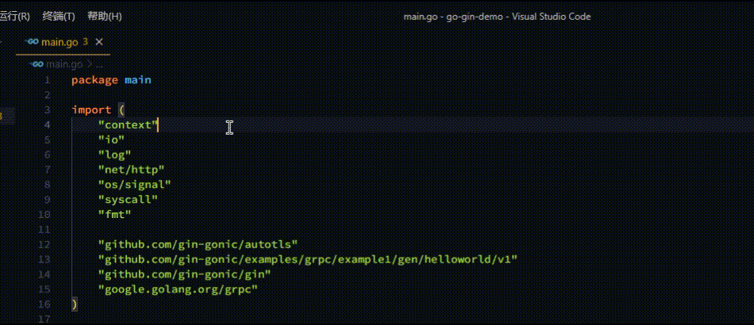

# go-imports-alphabetical README

This is an Visual Studio Code Extension organize your go imports in alphabetical.  

## Usage
* use shortcut `Ctrl+Shift+P`
* select/type `Sort Go Imports In Alphabetical`

## Why

The Go Extension with gopls currently uses `goimports` to sort imports and it doesn't provide any interface to change that.  
It is annoying when your Go project is maintained by both `vscode` and `goland` users due to diffierent import sort strategies.  
Especially when you are going to submit you code...  

## Extension Settings

there no any extension settings currently.

## Release Notes

### 0.0.1

organize go imports function works properly.

## For more information

contact me at
[github.com/AlpsMonaco/go-imports-alphabetical](https://github.com/AlpsMonaco/go-imports-alphabetical)

**Enjoy!**
