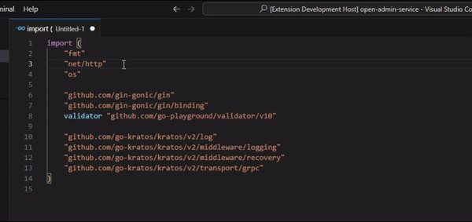

# go-imports-alphabetical README

[中文](#Chinese)

This Visual Studio Code extension organizes your Go imports alphabetically.



## NEW FEATURE!!!🎉🎉🎉
This extension can now be configured as a formatter!!!
add the following JSON settings to your `settings.json` file (either globally or in your workspace):  
```json
"[go]": {
    "editor.codeActionsOnSave": {
        "source.organizeImports": "never"
    },
    "editor.defaultFormatter": "alpsmonaco.go-imports-alphabetical",
    "editor.formatOnSave": true, //optional
}
```
By default, this extension will run `gofmt` to format your currently open Go file and then sort all imports in alphabetical order.  
The `gofmt` tool is included with your Go installation.
If you'd like to use a different formatting tool instead of gofmt, you can specify it in your settings:
```json
{
    "goImportsAlphabetical.preformatTool": "goimports"
}
```

as a formatter, you could use the following methods to format go files.
* use shortcut `Shift+Alt+F`
* use shortcut `Ctrl+Shift+P` and the choose `Format Document`


# Why Use This Extension?
The official Go Extension with gopls currently uses goimports to sort imports, and it doesn’t provide an option to change this behavior.  
This can be frustrating when your Go project is maintained by both Visual Studio Code and GoLand developers, as they may use different import sorting strategies.  
This difference can lead to unwanted changes, especially when you are about to submit your code.


# NOTICE
If this extension formats your Go file correctly, you’re all set!   
You don’t need to read any further—just start coding in Go.

# Prerequisite
You may need to define the following JSON settings in either user.json or workspace.json.  
Accroding to issue: https://github.com/microsoft/vscode-go/issues/3059#issuecomment-589072036.  
But when you import a new package,gopls will still sort you imports by `goimports`.That's why you might need this extension.    


```json
    "[go]": {
        "editor.codeActionsOnSave": {
            "source.organizeImports": "never"
        },
        "editor.formatOnSave": false,
    },
```

## Usage
* use shortcut `Ctrl+Shift+P`
* select/type `Sort Go Imports In Alphabetical`


## Extension Settings

`goImportsAlphabetical.keepEmptyLine`  
`default:false`

Whether to keep empty line or not.  
If enabled,all imports will be separated by empty lines,grouped into each group,  
then sorted within groups while keeping the empty lines.


`goImportsAlphabetical.ignoreImportAlias`  
`default:true`

Choose whether to sort by import package aliases.If enabled,ignore imports aliases and then sort.


`goImportsAlphabetical.moveToTopAfterSort`  
`default:true`

When the sort is successful,scroll to top of the document.  

## Release Notes

### 0.0.1

organize go imports function works properly.

### 0.0.2

update readme.md with gif.

### 0.0.3

update Chinese documentation.

### 0.0.4

update extension settings.

### 0.0.5

update Chinese documentation.

### 0.0.6

add variant option `Sort Go Imports in Alphabetical : keep empty line`

### 0.0.7 - 0.0.11

* add debug log
* trace vscode extension bug: 'trim() is not a function'

### 0.0.12 -  0.0.13

fix vscode extension bug: 'trim() is not a function'


## For more information

contact me at
[github.com/AlpsMonaco/go-imports-alphabetical](https://github.com/AlpsMonaco/go-imports-alphabetical)


**Enjoy!**

<a id="Chinese"></a>

这个插件帮助你把 go 的导入包按字母顺序排序

# 先决配置

你可能需要先定义以下的json设置在你的 user.json 或者 workspace.json 中  
来源issue: https://github.com/microsoft/vscode-go/issues/3059#issuecomment-589072036.  
但是当你导入新的包的时候，gopls还是会用goimports来排序你的导入包，这就是为啥你可能需要这个插件    


```json
    "[go]": {
        "editor.codeActionsOnSave": {
            "source.organizeImports": "never"
        },
        "editor.formatOnSave": false,
    },
```


## 用法
* 使用快捷键 `Ctrl+Shift+P`
* 选择/输入 `Sort Go Imports In Alphabetical`


## 为什么要做这个插件

当前官方的go插件使用gopls语言服务器，只支持goimports，没办法修改。  
当你的go项目开发成员同时用`vscode` 和 `goland`的时候会很麻烦。  
尤其是提交代码的时候。。。  


## 插件设置

`goImportsAlphabetical.keepEmptyLine`  
`default:false`

是否保留空行


`goImportsAlphabetical.ignoreImportAlias`  
`default:true`

包的别名是否参与排序

## Release Notes

### 0.0.1

测试核心功能工作正常

### 0.0.2

增加gif用例

### 0.0.3

添加中文文档

### 0.0.4

更新插件设置

### 0.0.5

更新中文文档

### 0.0.6

 增加选项


## For more information

在github上联系我:  
[github.com/AlpsMonaco/go-imports-alphabetical](https://github.com/AlpsMonaco/go-imports-alphabetical)


**Enjoy!**